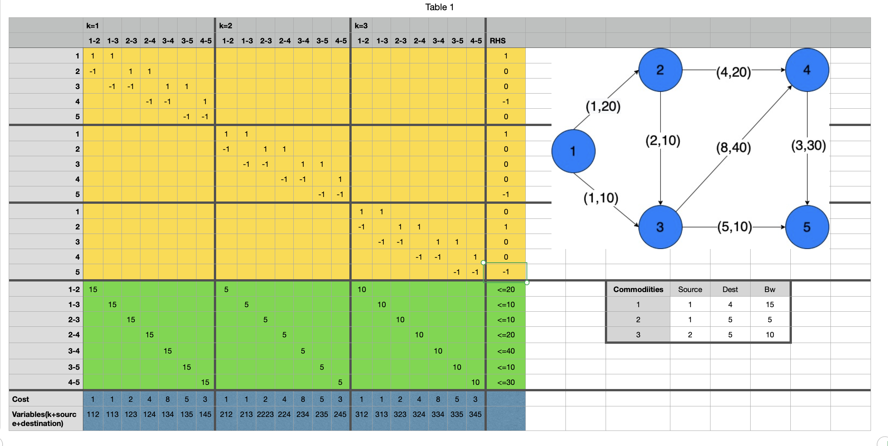
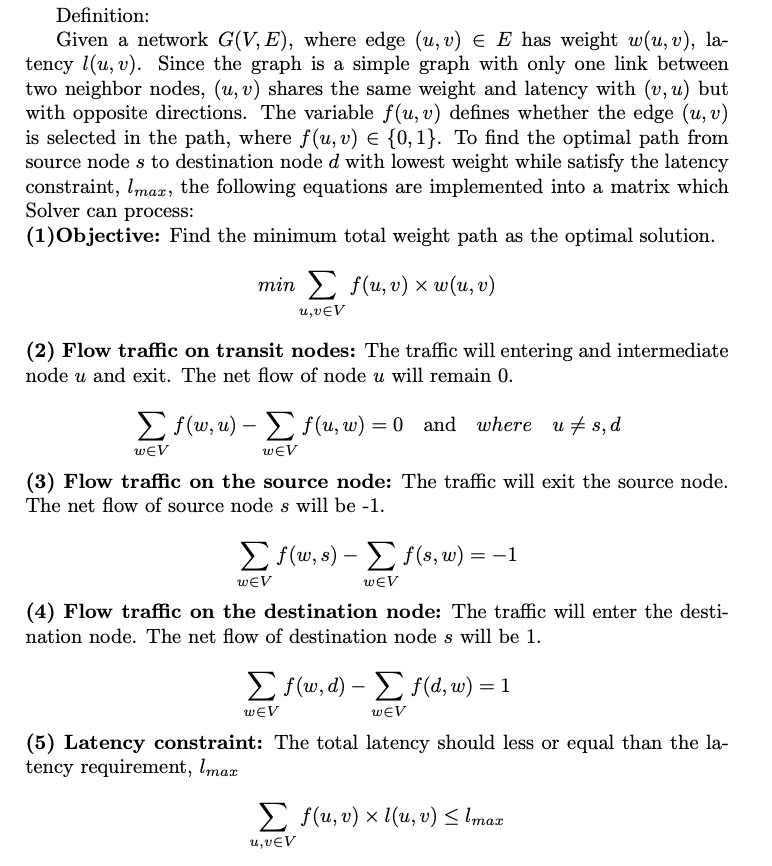

# Background

PCE uses [Google OR-Tools][or-tools] to solve routing problems with
some given constraints such as bandwidth and latency requirements. It
takes in a formulation matrix with defined objective functions and
relationships with RHS.

The "load balancing" solver in PCE is developed based on the
Constrained Shortest Path (CSP) problem.  Given an input of a list of
queries, we try to find an overall optimal solution.

Here's an example of how it is done:

<!-- TODO: expand discussion on this image -->

In PCE, links are set to be binary variables: if a link is selected,
the corresponding variable is 1, if a link is not selected, the
variable is 0.

## Constrained Shortest Path (CSP)

A topology will be represented in a JSON format.  Each link in the
network will have three attributes: cost, latency and bandwidth.

<!-- TODO: describe these better -->

- nodes: Number of nodes in the graph
- p: Probability of link creation
- max_latency: Used for testing the heuristic sorting method. Can be
  set to 99999 for regular topology.
- bwlimit: Remove any link that is lower than this bwlimit. There is
  connectivity check before the final creation of the topology, new
  topology will be created if the current one is not connected.

Formulation:

## Utility and Benchmark

<!-- TODO: is this up-to-date? -->

Other utility funcions are aslo included, such as: Dijkstra
algorithms, network connectivity check, etc.

Benchmark results are also provided. Computation time and cost
difference std are being tested between solver formulation and
heurtistic sorting methods (by latency and by cost).

<!-- URLs -->

[or-tools]: https://developers.google.com/optimization/
